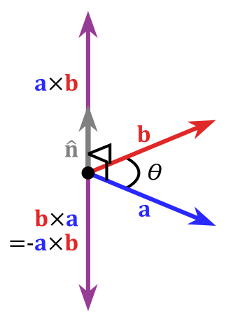
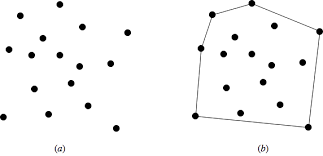

# Convex Hull

## Cross Product: A Fundamental Tool in Computational Geometry

### Definition and Formula

The cross product is a binary operation on two vectors in three-dimensional space. Given two vectors **A** = (Ax, Ay, Az) and **B** = (Bx, By, Bz), their cross product **A** × **B** is defined as:

$$ \textbf{A} \times \textbf{B} = (A_{y}B_{z} - A_{z}B_{y}, A_{z}B_{x} - A_{x}B_{z}, A_{x}B_{y} - A_{y}B_{x})  $$

This results in a new vector that is orthogonal (perpendicular) to both **A** and **B**. The magnitude of **A** × **B** is equal to the area of the parallelogram that **A** and **B** span, which is a key concept in geometric interpretations.

  
    <figcaption>Caption: Cross product vector.</figcaption>

### Application in 2D Computational Geometry

In two-dimensional geometry, especially in algorithms like the Convex Hull, the cross product is often simplified. Considering 2D vectors **A** = (Ax, Ay) and **B** = (Bx, By), the "2D cross product" can be represented as the scalar:

$$ \textbf{A} \times \textbf{B} = A_{x}B_{y} - A_{y}B_{x} $$

This scalar is crucial for determining the orientation of three points (say A, B, and C). If the result is positive, B lies to the left of the line formed by A and C, indicating a counter-clockwise turn. If it's negative, B lies to the right, indicating a clockwise turn. This concept is fundamental in Convex Hull algorithms like Graham's Scan and Jarvis's March, where the order and orientation of points are pivotal for determining the hull's boundary.

### Importance in Convex Hull Algorithms

In the context of computing the Convex Hull, the cross product helps in identifying the outermost points that form the "hull" of a set of points. By iterating over points and using the cross product to check turns at each step, algorithms can effectively "wrap" around the set of points, much like stretching a rubber band around them. This simple yet powerful application of the cross product is what makes it indispensable in computational geometry.

## Determine whether the line segments are turning left or right
Our next problem that need to be considered is how to determine whether the line segments are turning left or right, which is two continuous line segment $'\overrightarrow{\rm p_1p_2}'$' . I would state that this section contains that most essential idea of the Convex Hull problem , since we need to determine whether the line segments are turning left or right in order to determine whether the line segments are convex or not. 
Utilizing cross product can avoid the calculation of the angle between line segments. What all we need to do is to determine whether the next line segment locates clockwise or anti-clockwise to the previous line segment. We calculate the cross product:
$$(p_2-p_0) \times (p_1-p_0)$$
If the result is positive, then the line segments are turning clockwise at $'p_1'$, which is right; otherwise, the line segments are turning left.

## Search for convex hull
The convex hull of a point set **Q** is a convex polygon **P** such that each point in **Q** is either on the boundary of **P** or in its interior. If we imagine all the points in the set **Q** as a pin, thus, the convex hull is a tensed rubber band that wraps all the pins. The image below shows an example of the convex hull:

  
    <figcaption>Caption: Cross product vector.</figcaption>

We are going to dig into one of the most common used algorithm for locates the convex hull, known as Graham's scan, with time complexity of _O(n log n)_ .